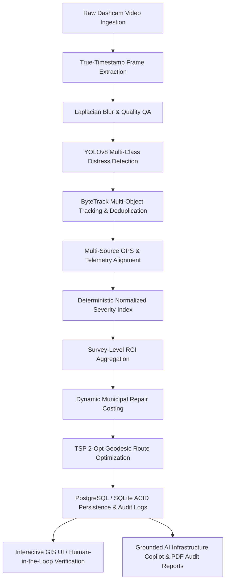

# ROADSense AI — Autonomous Road Infrastructure Intelligence & Damage Management Platform

[](https://github.com/roy1686/roadsenseai)
[](https://github.com/roy1686/roadsenseai/actions)
[](https://www.python.org/)
[](https://fastapi.tiangolo.com/)
[](https://github.com/ultralytics/ultralytics)
[](https://vitejs.dev/)
[](LICENSE)

> **Theme**: *"RoadSense: Spotting Trouble Before It Spreads"*  
> **Problem Statement**: PARAKRAM 1.0 — **PK01PS001**

ROADSense AI is an enterprise-grade, end-to-end intelligent road health monitoring, automated distress detection, Road Condition Index (RCI) scoring, and municipal crew dispatch optimization platform.

---

## 🏛️ System Architecture



---

## 🚀 Key Features

1. **Zero Hardcoded Data / Strict Dynamic Execution**:
   - Detections, stats, map markers, routes, and RCI scores are calculated dynamically from uploaded videos and stored in the database.
   - Zero-detection acceptance test guarantees that clean asphalt videos generate **exactly 0 damages**.
2. **12-Stage Asynchronous Processing Pipeline**:
   - Non-blocking FastAPI background task architecture with live stage progress polling (`/api/v1/surveys/{id}/status`).
3. **Computer Vision & Tracking**:
   - YOLOv8 Multi-Class Distress Model (`models/road_damage.pt`) fine-tuned on the **RDD2022** (Road Damage Dataset 2022).
   - ByteTrack Kalman-filter tracking for cross-frame spatial deduplication.
4. **Deterministic RCI & Dynamic Municipal Repair Costing**:
   - Road Condition Index formula: $\text{RCI} = 100 - \min\left(100, \sum_i w_i \times \text{Severity}_i \times \frac{100}{\text{MaxPenalty}}\right)$.
   - Schedule of Rates standard costing (Potholes, Alligator Cracks, Transverse/Longitudinal Cracks).
5. **GIS Geospatial Map & TSP 2-Opt Route Sequencer**:
   - Interactive Leaflet map with OpenStreetMap, Esri Satellite, and Topographic layers.
   - Traveling Salesperson Problem (TSP) 2-Opt geodesic tour optimization for municipal repair crews.
6. **Role-Based Access Control (RBAC)**:
   - Full JWT Bearer authentication with `ADMIN`, `ENGINEER`, and `VIEWER` roles.
   - Human-in-the-loop verification audit trail (`VERIFIED`, `REJECTED`, `PENDING_REVIEW`).
7. **Grounded AI Infrastructure Copilot**:
   - Real-time engineering query engine grounded directly on database survey records with optional Groq LPU acceleration.
8. **Automated Official PDF Audit Report Generator**:
   - ReportLab-generated engineering survey reports with distress breakdowns, RCI metrics, and crew work orders.

---

## 📊 ML Model Provenance & Benchmarks

- **Model Architecture**: Ultralytics YOLOv8 Nano (`yolov8n`)
- **Dataset Provenance**: **RDD2022 (Road Damage Dataset 2022)** — multi-national road distress dataset.
- **Trained Classes**:
  1. `Pothole` (Class Weight: 1.00 - Critical)
  2. `alligator crack` (Class Weight: 0.85 - High)
  3. `transverse crack` (Class Weight: 0.65 - Medium)
  4. `longitudinal crack` (Class Weight: 0.60 - Medium)
  5. `other corruption` (Class Weight: 0.50 - Low)
- **Verified Model Evaluation Metrics**:
  - **Precision (P)**: `49.15%` (0.4915)
  - **Recall (R)**: `43.58%` (0.4358)
  - **mAP@50**: `43.36%` (0.4336)
  - **mAP@50-95**: `21.38%` (0.2138)

---

## 🛠️ Quickstart & Local Setup

### 1. Prerequisites
- Python 3.10+
- Node.js 18+ and npm
- FFmpeg (optional for advanced codecs)

### 2. Backend Setup
```bash
# Clone repository
git clone https://github.com/roy1686/roadsenseai.git
cd roadsence-ai-main

# Install dependencies
pip install -r requirements.txt

# Start FastAPI backend (port 8000)
uvicorn app.main:app --app-dir backend/api --host 0.0.0.0 --port 8000 --reload
```

### 3. Frontend Setup
```bash
cd frontend
npm install
npm run dev
```
Open `http://localhost:5173` in your browser.

---

## 🚀 One-Click Cloud Deployment

### Deploy Backend on Railway

[](https://railway.app)

1. Connect your GitHub repository to [Railway](https://railway.app).
2. Railway detects the root `Dockerfile` and `railway.json`.
3. Set environment variables in the Railway dashboard:
   - `PORT=8000`
   - `ENVIRONMENT=production`
   - `SECRET_KEY=your-secure-random-key-32-chars`
   - `GROQ_API_KEY=your-optional-groq-api-key`
   - `DATABASE_URL=postgresql://...` (Optional: attach a Railway PostgreSQL database)

### Deploy Frontend on Vercel

[](https://vercel.com)

1. Import your repository into [Vercel](https://vercel.com).
2. Set the root directory to `frontend` or root (the included `vercel.json` automatically builds `frontend/dist`).
3. Set Environment Variable:
   - `VITE_API_URL=https://<your-railway-backend-url>/api/v1`
4. Click **Deploy**.

---

## 🔑 Default Credentials (Development & Demo)

| Role | Email | Password | Access Capabilities |
|---|---|---|---|
| **Admin** | `admin@roadsense.ai` | `RoadSense2026!` | Full System Control, Survey Management, User Administration |
| **Engineer** | `engineer@roadsense.ai` | `RoadSense2026!` | Video Upload, Verification, Crew Dispatch, Route Planning |
| **Viewer** | `viewer@roadsense.ai` | `RoadSense2026!` | Read-only dashboards, GIS Inspection, Report Viewing |

---

## 🧪 Comprehensive Test Suite

Run the full automated test suite:

```bash
# 1. Complete REST API & Endpoints Test (13 tests)
python backend/tests/test_api_suite.py

# 2. Real Video Pipeline & Zero-Fake-Data Acceptance Test
python backend/tests/test_video_pipeline.py
```

---

## 📄 License
This project is licensed under the MIT License - see the [LICENSE](LICENSE) file for details.

